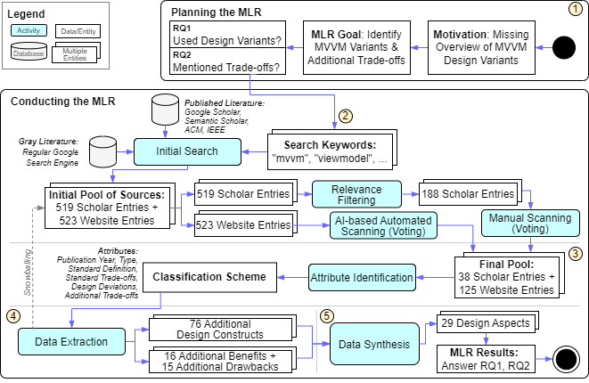

# Model-View-ViewModel Multi-vocal Literature Review

This repository contains all artifacts of the Model-View-ViewModel (MVVM) Multi-vocal Literature Review (MLR) study.
Additionally, the repository provides scripts to semi-automate several steps of the MLR like the initial classification or result filtering.

## MLR Main Artifacts

To quickly get to most relevant MLR artifacts, you can navigate to the following files:

* [MVVM Standard Definition](step2_search_process/mvvm_standard_definition.md): Detailed MVVM standard definition used as baseline
* [Filtered Scholar Entries](step2_search_process/scholar_searches/relevantPapers.csv): Scholar entries after relevance filtering (188 entries)
* [Voted Scholar Entries](step2_search_process/output/papers/site_initial_classification_papers.md): Scholar entries after manual voting (38 accepted for attribution, 39 standard definitions)
* [Voted Website Entries](step2_search_process/output/chatgpt/chatgpt_scans.csv): Website entries after AI-based voting (125 accepted for attribution; `B` or `C`)
* [Design Constructs and Tradeoffs](step4_data_extraction/data_extraction_overview.md): Holistic overview of 76 additional design constructs grouped into 29 design aspects, 16 additional benefits, and 15 additional drawbacks
* [RQ Answers](step5_data_synthesis/answers_of_research_questions.md): Explicit answers to the research questions.
* [Synthesized Usage Statistics](step5_data_synthesis/usage_statistics.md): Overview of usage statistics.

## MLR Process Steps

The MLR Study is divided into 5 steps, which each has an own README.me with a more detailed description:

**Step 1**: Planning the MLR `step1_planning/README.md`

**Step 2**: Search Process `step2_search_process/README.md`

**Step 3**: Attribute/Classification Design `step3_attribute_classification_design/README.md`

**Step 4**: Data Extraction `step4_data_extraction/README.md`

**Step 5**: Data Synthesis `step5_data_synthesis/README.md`
