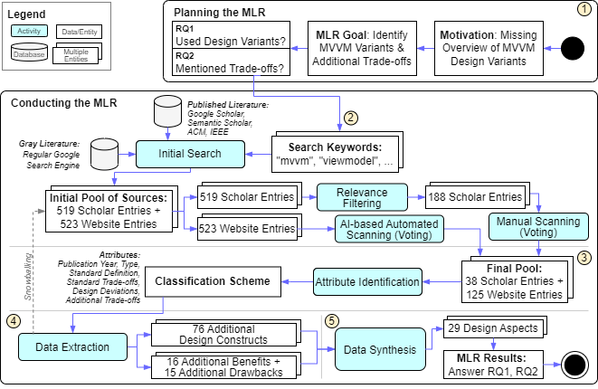

## ZIP for Double-Blind Submission

Select the Folders/Files:

[gradle](gradle)
[src](src)
[step1_planning](step1_planning)
[step2_search_process](step2_search_process)
[step3_attribute_classification_design](step3_attribute_classification_design)
[step4_data_extraction](step4_data_extraction)
[step5_data_synthesis](step5_data_synthesis)
[.gitignore](.gitignore)
[build.gradle.kts](build.gradle.kts)
[gradle.properties](gradle.properties)
[gradlew](gradlew)
[gradlew.bat](gradlew.bat)

[README.md](README.md)
[settings.gradle.kts](settings.gradle.kts)

Important: Do not include:
* `.git` folder
* LICENSE file
* how-to-double-blind.md

Important: ensure `https://github.com/Fumapps` is replaced with https://github.com/anonymized

## Sanity Check of ZIP to Submit

* full-text search
  * "Fuksa", "Speth" => only in search results etc.
  * "Fumapps" => must not occur
* `gradlew step2_MultiVocalLiteratureMain-chatgpt-next-chunk` works
* `gradlew step2_MultiVocalLiteratureMain-chatgpt-scan-results` works
* `gradlew step2_MultiVocalLiteratureMain-chatgpt-unsure-check` works
* `gradlew step2_PaperLiteratureMain-join-search-results` works
* `gradlew step2_PaperLiteratureMain-initial-classification` works
* `gradlew step4_WebsiteStepByStepCheck` works
* `gradlew step4_PaperStepByStepCheck` works
